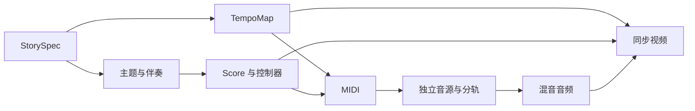

# 叙事配乐

## 功能范围

新增 `musician story <spec.json>`。人或 Agent 编写经过校验的 JSON，明确段落顺序、画面时间点、主题与配器；程序负责确定性作曲、MIDI、音源渲染、混音和可选视频。文本感觉与图片模式继续使用原有入口。

交付《原来是你》示例：58 小节、23 声部、七段（0、27、44、64、84、108、133、186 秒）、六音主题及 19 段双语叙事文字。音符数量由编曲决定，不用无意义的音符凑数。

输出包括完整及分轨 MIDI、包含实际音符时间的 `score.json`、原始及处理后的分轨、最终 WAV/MP3、音源报告；开启视频时增加 MP4。`--midi-only` 用于检查乐谱，`--fallback` 用于草稿，`--strict` 要求所有声部使用配置的正式音源。

## 数据与时间

共享契约集中在 `src/types/`，由现有 Pydantic 依赖校验并生成 JSON Schema。故事模型记录乐器、声部职责、主题使用、和弦、段落时间与字幕；乐谱继续复用 `Score`、`Note`、`CC`。[^score]

每小节速度统一量化为 MIDI 的微秒每拍。段落由小节数与目标秒数反算速度，渐慢通过相对速度曲线拟合，尾响包含在总时长内。音频样本、音符动画和字幕使用同一时间换算；全片误差应小于 30 fps 的一帧。首次版本保持 4/4 拍，每小节一个和弦。

## 作曲与配器

主题显式保存为音高、时值序列。每次使用指定声部、位置、移调与时值倍率；Boss 段降低八度、时值加倍，认出时返回原主题。伴奏按根音、三音、七音、色彩音、分解和弦、脉冲、独立回应和打击乐分工，支持现有和弦及本例需要的七、九、十三和弦。

乐器目录保存中英名称、音域、GM program 与音色家族；实际 SFZ、SF2 或 Surge patch 由故事中的声部配置指定。音符力度、乐句表情、管乐休止、钢琴踏板与短音/震音按乐器处理。真实连奏与 keyswitch 必须匹配采样库，不把缩短 MIDI 音符称作真实短弓采样。

每个声部独立渲染。完整 MIDI 为各轨写入端口与通道，避免超过 16 通道后 program/CC 冲突；导入 DAW 时须正确分配音源。

## 乐谱交付与人工修改

故事输出同时提供 MusicXML 总谱、各声部分谱和中英乐器清单。MusicXML 用 music21 排出小节、休止、连结线、谱号、调号、和弦与段落标记；统一使用实际音高（concert pitch）。初版是供编辑的自动排谱稿，专业演奏前仍需检查移调分谱、弓法、呼吸和排版。

记谱时值与演奏时值分开：`Note.notation_dur` 可选地记录作曲时的名义时值，`dur` 仍控制音频；乐谱量化到十六分音符，原始 MIDI 保留连奏重叠、力度与控制器。`--sheet-preview` 使用可选 verovio 依赖生成可打印的 SVG/HTML 总谱和分谱。

交接包包含 `story.json`（音源路径转为绝对路径）、`midi/full.mid`、`notation/` 与 `HANDOFF.md`。编辑人员可在 MuseScore、Dorico 等软件打开 MusicXML，或在 DAW 直接改 MIDI，然后导出保留声部 ID 的多轨 type-1 MIDI，通过 `musician story story.json --midi edited.mid` 重新渲染。导入后从实际 MIDI 重建 `score.json` 和乐谱，复用现有音源、混音和视频流程，不再自动作曲。

当前允许改音高、节奏、力度、踏板与表情，保留故事的声部集合、4/4 拍、总小节数及速度表；导入检查轨名、音符配对、事件范围和速度，不静默忽略不支持的结构改动。已有音符轨可全部休止，但不能新增未配置的乐器。原始控制器与弯音等 MIDI 通道事件随输出保留，具体是否发声取决于所选音源。音源文件本身不随包复制，换机器须重设路径。

## 编曲依据与当前取舍

本例按影视叙事配乐处理：平静段突出主题与留白，危机段允许密集节奏和紧张和声。参考 [music-composition skill](../.agents/skills/music-composition/SKILL.md) 的声部连接、编曲密度和再和声章节，并用 Open Music Theory 交叉核对。该 skill 是第三方知识资料，以固定版本保存在仓库 `.agents/skills/music-composition/`，来源与许可证见 [UPSTREAM.md](../.agents/skills/music-composition/UPSTREAM.md)。[^composition-skill][^voice-leading]

- 分解和弦根据上一音选择较近的和弦音，在乐器中心音上下一个八度内选音，并服从实际音域；每段重新选择起始音区。这个约束只用于自动伴奏，主题的大跳和移调由谱例明确决定。
- `counter` 声部在每两个小节的后一个小节轮流演奏回答，已经退场的声部不参与轮换。减少多件木管同拍复制同一旋律，同时保留独立音色。
- 《原来是你》的吉他改为稀疏色彩音，钢琴继续负责主要分解和弦。全曲保留 23 个声部，声部无需一直同时演奏。
- 七音、九音、十三音以及经过音都可能构成有意的张力；是否合适要结合节拍、前后走向和剧情判断。此轮保留主题与和弦进行，不把所有非和弦音或大跳判为错误。[^embellishment]

以上是本项目自动伴奏的默认取舍，不是所有风格都必须遵守的乐理规则。单元测试能检查音域、连接、声部轮换和时间点；主观听感仍通过等响度对比试听验收。

## 渲染与混音

复用现有 Surge、sfizz、numpy 兜底和 pedalboard 混音，补充 FluidSynth CLI 对 SF2 的支持。各声部记录实际后端；正式音源缺失时普通模式明确报告降级，严格模式失败。[^render]

现有全局配置在叙事任务期间暂时切换，任务结束或失败均恢复，并与网页生成共用锁。输出放在独立目录，避免覆盖原有默认作品。缓存须包含有效音源配置、依赖文件状态、后端及渲染代码版本，换音色或安装插件后不能复用旧草稿。

故事模式逐轨渲染，限制峰值内存；本轮复用网页模式的缓存修复，但故事任务使用独立输出并完整渲染。
默认混音保留器乐频段，提供 `--voice` 时才开启旁白让位。`--strict` 验证音源实际成功渲染，不能替代对采样库演奏法的试听。

## 视频

Pillow 绘制双语轨道、按音高/时值/力度映射的音块、当前段落和字幕。真实最终音频经短时傅里叶变换形成底部频谱瀑布。逐帧流式交给 FFmpeg，使用音频作为时长基准，避免把全片图像存进内存。视频字体可显式指定；默认查找支持中文的系统字体。

## 验收

- 已有测试继续通过；补充非法规格、精确时间、主题变形、MIDI 端口、音色缓存、控制器转发及音画同步测试。
- 全部 23 声部有音符，且在乐器音域和曲目时间内；所有段落落点在一帧误差内。
- 完整示例的兜底渲染产生约 186 秒非静音音频与可解码视频，响度与峰值报告有效。
- 没有安装插件或采样库的环境只证明草稿流程；正式音色必须通过实际音源验收。

[^score]: 现有乐谱与 MIDI 写出。
[^render]: 现有渲染与混音。
[^composition-skill]: 已阅读 SKILL.md、导航和 `references/harmony/voice-leading.md`、`references/orchestration/arrangement-density.md`、`references/harmony/reharmonization.md`，版本固定在来源所列 commit。
[^voice-leading]: 声部连接、线条独立性以及张力与放松的平衡。
[^embellishment]: 经过音、邻音、延留音等须结合前后走向分析。
